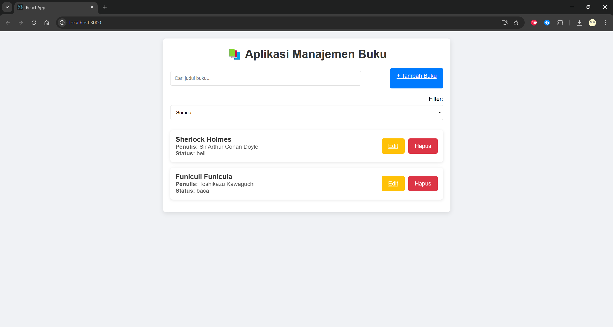
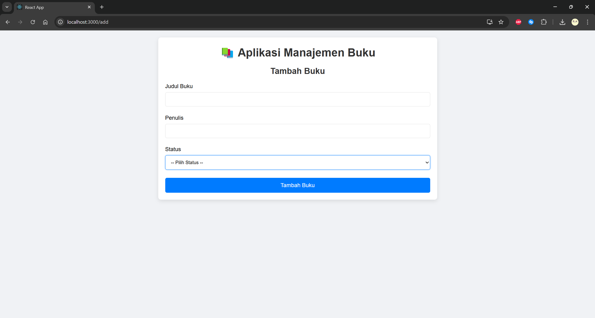
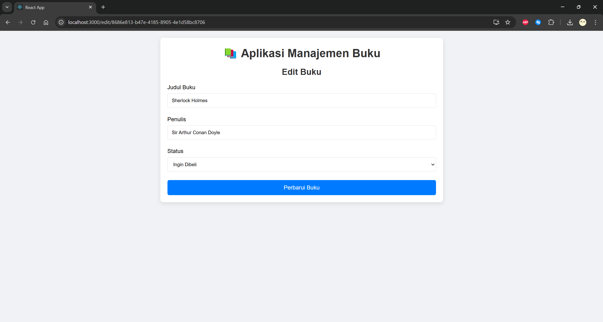

# 📘 Aplikasi Manajemen Buku Pribadi

Aplikasi ini memungkinkan pengguna untuk mencatat buku-buku yang dimiliki, sedang dibaca, atau ingin dibeli. Aplikasi ini dirancang dengan React dan menyimpan data secara lokal menggunakan `localStorage`.

---

## 🧩 Fitur Aplikasi

- ✍️ Menambah buku (judul, penulis, dan status: milik/baca/beli)
- 🛠️ Mengedit dan menghapus buku
- 🔍 Pencarian buku berdasarkan judul
- 🧮 Filter buku berdasarkan status
- 💾 Data tersimpan secara **lokal (localStorage)**

---

## ⚙️ Instruksi Instalasi & Menjalankan Aplikasi

### 1. Clone repositori
```bash
git clone https://github.com/username/buku-pribadi.git
cd buku-pribadi
```

### 2. Install dependencies
```bash
npm install
```

### 3. Jalankan aplikasi
```bash
npm start
```

Aplikasi akan berjalan di `http://localhost:3000`.

### 4. Menjalankan Unit Test
```bash
npm test
```

---

## 🖼️ Screenshot Antarmuka

Berikut tampilan antarmuka aplikasi:

### Beranda


### Tambah Buku


### Edit Buku


> 💡 Catatan: Letakkan gambar screenshot di folder `public/screenshots` atau `src/assets/screenshots` dan sesuaikan path-nya di atas jika perlu.

---

## ⚛️ Fitur React yang Digunakan

| Fitur                           | Penjelasan                                                                 |
|--------------------------------|----------------------------------------------------------------------------|
| **Functional Components**      | Semua komponen dibuat menggunakan `function` dan React Hooks              |
| **React Hooks**                | `useState`, `useEffect`, `useContext`, dan custom hook `useForm`         |
| **Context API**                | Digunakan untuk global state (`BookContext`)                              |
| **React Router**               | Navigasi antar halaman seperti `/`, `/add`, dan `/edit/:id`              |
| **PropTypes**                  | Validasi props di komponen seperti `BookItem`, `BookForm`, dan `Filter`  |
| **localStorage**               | Menyimpan data buku secara lokal tanpa backend                            |
| **Custom Hooks**               | `useForm` untuk reusable logic pengelolaan form                           |
| **Error Handling**             | Validasi input pada form tambah/edit buku                                 |
| **React Testing Library**      | Tersedia minimal 5 unit test untuk komponen utama                         |

---